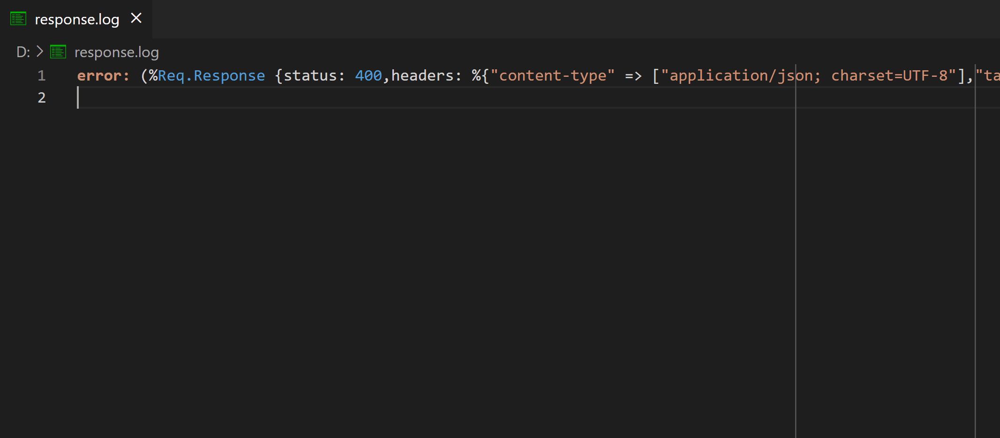

# Decondenser

A Visual Studio Code extension that automatically formats any text or code based on bracket placement (`{}`, `[]`, `()`).

It expands condensed code into a readable, multi-line structure with proper indentation whenever an opening bracket is detected.

## Features

- ↕️ **Bracket-based** formatting detects and expands `{}`, `[]`, and `()` into multi-line structures.
- 🔎 **Two commands** for formatting text/code with or without escaping characters.
- ⚙️ **Configurable** number of indentation spaces with `decondenser.indentationSize` setting.

## Extension Settings

* `decondenser.indentationSize`: Set the number of spaces used for indentation.
